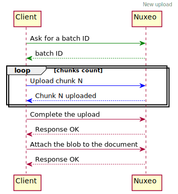
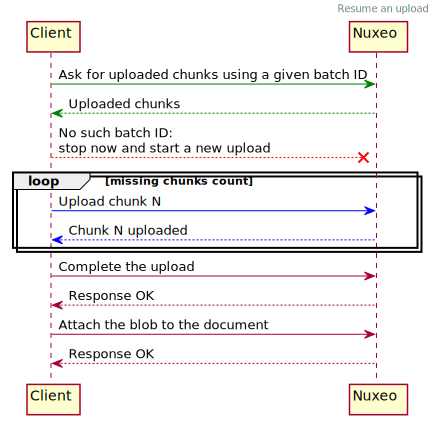
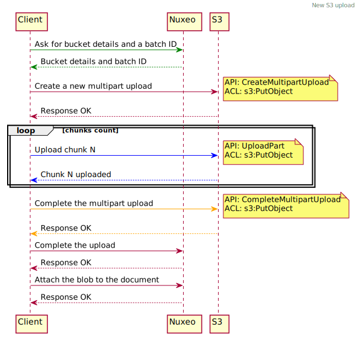
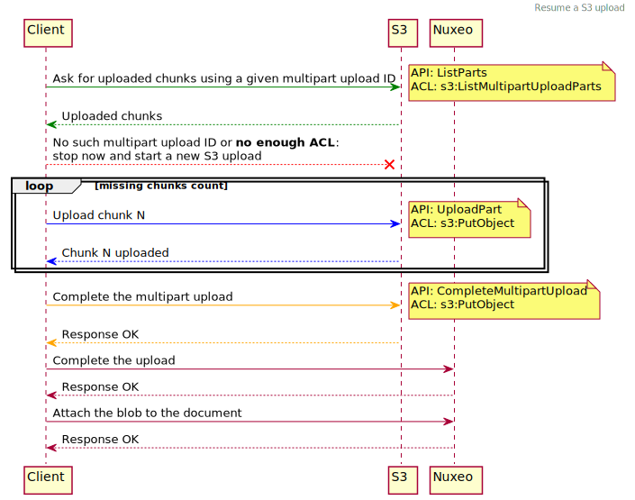

# Upload Process

Find here sequencial diagrams of how chunked uploads are managed.

To generate final SVGs:
```bash
# To do from the repositoy root
plantuml -tsvg docs/uploads.md
```

## Using the Default Upload Handler

### New Upload



<!--
@startuml img/new-upload.svg
header New upload

Client -[#green]> Nuxeo: Ask for a batch ID
Client <[#green]-- Nuxeo: batch ID

loop chunks count
Client -[#blue]> Nuxeo: Upload chunk N
Client <[#blue]-- Nuxeo: Chunk N uploaded
end

Client -> Nuxeo: Complete the upload
Client <-- Nuxeo: Response OK

Client -> Nuxeo: Attach the blob to the document
Client <-- Nuxeo: Response OK

@enduml
-->

### Resume an Upload



<!--
@startuml img/resume-upload.svg
header Resume an upload

Client -[#green]> Nuxeo: Ask for uploaded chunks using a given batch ID
Client <[#green]-- Nuxeo: Uploaded chunks
Client --[#red]x Nuxeo: No such batch ID:\nstop now and start a new upload

loop missing chunks count
Client -[#blue]> Nuxeo: Upload chunk N
Client <[#blue]-- Nuxeo: Chunk N uploaded
end

Client -> Nuxeo: Complete the upload
Client <-- Nuxeo: Response OK

Client -> Nuxeo: Attach the blob to the document
Client <-- Nuxeo: Response OK

@enduml
-->

## Using the Amazon S3 Upload Handler

### New S3 Upload

Required ACL:

- [s3:PutObject](https://docs.aws.amazon.com/AmazonS3/latest/dev/mpuAndPermissions.html)

Used APIs:

- [CreateMultipartUpload](https://docs.aws.amazon.com/AmazonS3/latest/API/API_CreateMultipartUpload.html)
- [UploadPart](https://docs.aws.amazon.com/AmazonS3/latest/API/API_UploadPart.html)
- [CompleteMultipartUpload](https://docs.aws.amazon.com/AmazonS3/latest/API/API_CompleteMultipartUpload.html)



<!--
@startuml img/new-upload-s3.svg
header New S3 upload

Client -[#green]> Nuxeo: Ask for bucket details and a batch ID
Client <[#green]-- Nuxeo: Bucket details and batch ID

Client -> S3: Create a new multipart upload
note right: API: CreateMultipartUpload\nACL: s3:PutObject
Client <-- S3: Response OK

loop chunks count
Client -[#blue]> S3: Upload chunk N
note right: API: UploadPart\nACL: s3:PutObject
Client <[#blue]-- S3: Chunk N uploaded
end

Client -[#orange]> S3: Complete the multipart upload
note right: API: CompleteMultipartUpload\nACL: s3:PutObject
Client <[#orange]-- S3: Response OK

Client -> Nuxeo: Complete the upload
Client <-- Nuxeo: Response OK

Client -> Nuxeo: Attach the blob to the document
Client <-- Nuxeo: Response OK

@enduml
-->

### Resume a S3 Upload

Required ACLs:

- [s3:PutObject](https://docs.aws.amazon.com/AmazonS3/latest/dev/mpuAndPermissions.html)
- [s3:ListMultipartUploadParts](https://docs.aws.amazon.com/AmazonS3/latest/dev/mpuAndPermissions.html)

Used APIs:

- [ListParts](https://docs.aws.amazon.com/AmazonS3/latest/API/API_ListParts.html)
- [UploadPart](https://docs.aws.amazon.com/AmazonS3/latest/API/API_UploadPart.html)
- [CompleteMultipartUpload](https://docs.aws.amazon.com/AmazonS3/latest/API/API_CompleteMultipartUpload.html)

Depending of current ACLs given to the AIM of the bucket, one may not be able to resume a transfer if the `s3:ListMultipartUploadParts` is not granted.
On the following diagram, you can see that there will be a **new upload** initiated if that is the case:



<!--
@startuml img/resume-upload-s3.svg
header Resume a S3 upload

Client -[#green]> S3: Ask for uploaded chunks using a given multipart upload ID
note right: API: ListParts\nACL: s3:ListMultipartUploadParts
Client <[#green]-- S3: Uploaded chunks
Client --[#red]x S3: No such multipart upload ID or  **no enough ACL**:\nstop now and start a new S3 upload

loop missing chunks count
Client -[#blue]> S3: Upload chunk N
note right: API: UploadPart\nACL: s3:PutObject
Client <[#blue]-- S3: Chunk N uploaded
end

Client -[#orange]> S3: Complete the multipart upload
note right: API: CompleteMultipartUpload\nACL: s3:PutObject
Client <[#orange]-- S3: Response OK

Client -> Nuxeo: Complete the upload
Client <-- Nuxeo: Response OK

Client -> Nuxeo: Attach the blob to the document
Client <-- Nuxeo: Response OK

@enduml
-->
